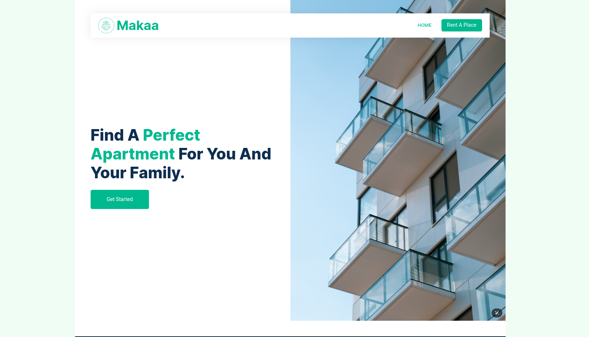

Sure! Here's a README file for the "Makaa Rent App":

---

# Makaa Rent App

Makaa Rent App is a web application that allows users to easily post and upload their rental properties. It provides a user-friendly interface for submitting property details and searching for available rentals.

## Features

- **Home Page:** View the home page of the application.
- **Form Page:** Submit rental property details through a form.
- **Search Page:** Search for rental properties based on location.
- **Details Page:** View detailed information about a specific rental property.
- **Image Upload:** Upload images for rental properties.




## Prerequisites

- Node.js
- MySQL

## Installation

1. Clone the repository:

```bash
git clone https://github.com/adjet-man/Makaa---Rent-App.git

```

2. Install dependencies:

```bash
npm install
```

3. Set up the database:

- Create a MySQL database named `makaa`.
- Create a table `rooms` with the following structure:

```sql
CREATE TABLE `rooms` (
  `rid` int(11) NOT NULL AUTO_INCREMENT,
  `Number` int(11) DEFAULT NULL,
  `Name` varchar(255) DEFAULT NULL,
  `Price` int(11) DEFAULT NULL,
  `Location` varchar(255) DEFAULT NULL,
  `Type` varchar(255) DEFAULT NULL,
  `Bathroom` int(2) DEFAULT NULL,
  `Bed` int(2) DEFAULT NULL,
  `Benefit_1` varchar(255) DEFAULT NULL,
  `Benefit_2` varchar(255) DEFAULT NULL,
  `Benefit_3` varchar(255) DEFAULT NULL,
  `Description` text,
  `Picture` varchar(255) DEFAULT NULL,
  PRIMARY KEY (`rid`)
);
```

4. Update the database connection details in `server.js`:

```javascript
const db = mysql.createConnection({
    host: '[insert host here]',
    user: '[insert user]',
    password: '[insert password]',
    database: '[insert database name]'
});
```

## Usage

1. Start the server:

```bash
node server.js
```

2. Open your browser and navigate to `http://localhost:3000` to access the Makaa Rent App.

## File Structure

```
.
├── public
│   ├── css
│   ├── js
│   └── images
├── uploads
│   └── (uploaded images)
├── views
│   ├── home.ejs
│   ├── form.ejs
│   ├── select.ejs
│   ├── apartments.ejs
│   ├── details.ejs
│   └── 404.ejs
├── app.js
└── README.md
```

## Routes

- **Home Page:** `GET /`
- **Form Page:** `GET /form`
- **Select Page:** `GET /select`
- **Apartments Page:** `GET /apartments`
- **Submit Form:** `POST /submit`
- **Search:** `GET /search`
- **Property Details:** `GET /details/:rid`

## Error Handling

- **404 Page:** Rendered when a requested route is not found.

